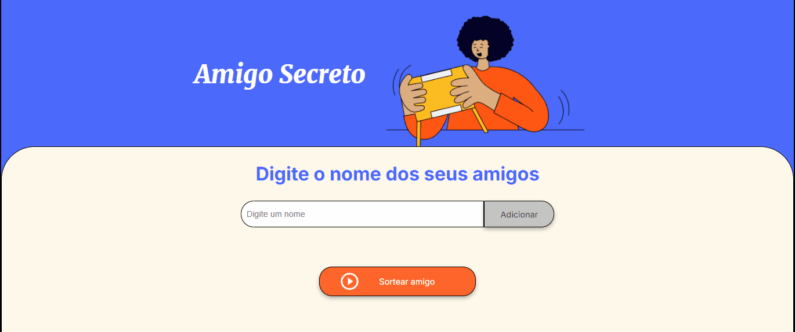

<h1 align='center'> Sorteador do Amigo Secreto</h1>

<h2 align='center'>Nesse repositorio você poderá baixar localmente essa aplicação para sortear o amigo secreto em seus eventos e confraternizações de final de ano</h2>

<h3 align='center'>Sobre o Projeto</h3>

Essa é uma implementação tem cunho inteiramente educacional e serve como modo de aperfeiçomento em lógica de programação. 
  É um desafio proposto pela Oracle Next Education (ONE) em parceria com a Alura tem com o objetivo principal criar uma alternativa para sortear um amigo secreto em confraternizações ou eventos, para que seja um sorteio de forma aleatoria.  Também é o modo dos alunos da ONE praticarem a logica de programação, seus conhecimento em JavaScript e em versionamento de codigos com Git e GitHub

<h3 align='center'>A implementação</h3>

Nesse projeto foi usado inteiramente as seguintes tecnologias:

  

        

<h4 align='center'>As principais funções do projeto estão listados abaixo:</h4>

>Função para adicionar amigos/participantes na lista
~~~JavaScript
function adicionarAmigo(){
    //selecionando o nome dos amigos 
    let nomeDoAmigo = document.querySelector('input').value
    //validação do nome 
    if(nomeDoAmigo == ''){
        alert('Por favor, insira um nome');
    }else{
        listaDeAmigos.push(nomeDoAmigo);
        console.log(listaDeAmigos);
        exibirAmigosNaTela();
    }
~~~
>Função para exibir o nome dos adicionados ne tela
~~~JavaScript
function exibirAmigosNaTela(){ 
    let lista = document.getElementById('listaAmigos'); 
    lista.innerHTML = " ";
        
    for(let i = 0; i <= listaDeAmigos.length; i++){
        let nome = document.createElement('li');
        nome.textContent = listaDeAmigos[i];
        lista.appendChild(nome);
    }
}
~~~
>Função para sortear o amigo
~~~JavaScript
function sortearAmigo(){
    let resultadoDoSorteio = document.getElementById('resultado');
    if(listaDeAmigos == []){
        alert('Por favor, insira um nome');
    }else{
        // escolhe um indice Aleatorio e consecutivamente um nome aleatorio no Array 
        let indiceAleatorio = Math.floor(Math.random() * listaDeAmigos.length);
        let nomeSorteado = listaDeAmigos[indiceAleatorio];
        console.log(nomeSorteado);

        // imprimi o resultado do nome sorteado na tela
        let resultado = document.createElement('li');
        resultado.textContent = `Seu Amigo Secreto é: ${nomeSorteado}`;
        resultadoDoSorteio.appendChild(resultado);
    }
}
~~~
>EXTRA
>Função limpar o campo do input
~~~JavaScript
function limparCampo(){
    document.querySelector('input').value = '';
}
~~~~

<h3 align='center'>Como instalar e executar o programa</h3>

Você pode fazer o download do arquivo .zip como mostrado abaixo:

Ou você pode clonar o repositorio pelo o Git Bash usando o seguinte comando:

~~~git
git clone https://github.com/VictorBatist/Amigo-Secreto.git
~~~

<h4 align='center'> Após isso é só acessar a pasta/repositorio baixado ou clonado e executar o index.html no seu navegador</h4>

